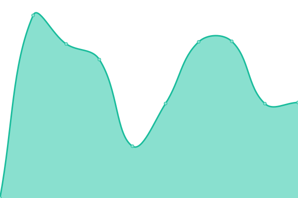
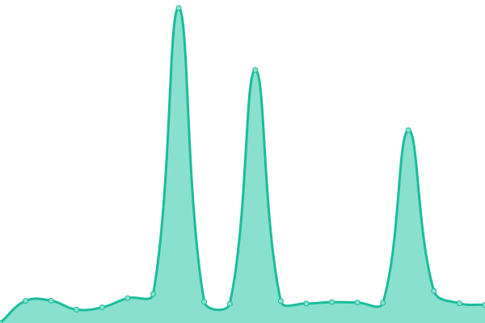

# [📈 Live Status](https://juanguara.github.io/upptime): <!--live status--> **🟩 All systems operational**

This repository contains the open-source uptime monitor and status page for [JuanGuara](https://juanguara.github.io/upptime), powered by [Upptime](https://github.com/upptime/upptime).

With [Upptime](https://upptime.js.org), you can get your own unlimited and free uptime monitor and status page, powered entirely by a GitHub repository. We use [Issues](https://github.com/juanguara/upptime/issues) as incident reports, [Actions](https://github.com/juanguara/upptime/actions) as uptime monitors, and [Pages](https://juanguara.github.io/upptime) for the status page.

<!--start: status pages-->
<!-- This summary is generated by Upptime (https://github.com/upptime/upptime) -->
<!-- Do not edit this manually, your changes will be overwritten -->
<!-- prettier-ignore -->
| URL | Status | History | Response Time | Uptime |
| --- | ------ | ------- | ------------- | ------ |
|  [Efecton](https://prestamo.efecton.com.ar) | 🟩 Up | [efecton.yml](https://github.com/juanguara/upptime/commits/HEAD/history/efecton.yml) | 

 2079ms
     
 | 

<a href="https://juanguara.github.io/upptime/history/efecton">100.00%</a>
    

|  [Sysgen](http://sms.cooperativacredikot.com.ar/hgesmedmain.aspx) | 🟩 Up | [sysgen.yml](https://github.com/juanguara/upptime/commits/HEAD/history/sysgen.yml) | 

 934ms
     
 | 

<a href="https://juanguara.github.io/upptime/history/sysgen">99.90%</a>
    

|  [Padron1](http://padronbcra.dyndns.info:9999/aconsultapaws.aspx?WSDL) | 🟩 Up | [padron1.yml](https://github.com/juanguara/upptime/commits/HEAD/history/padron1.yml) | 

 716ms
     
 | 

<a href="https://juanguara.github.io/upptime/history/padron1">100.00%</a>
    

|  [Nosis](https://ws02.nosis.com/soap11) | 🟩 Up | [nosis.yml](https://github.com/juanguara/upptime/commits/HEAD/history/nosis.yml) | 

 1635ms
     
 | 

<a href="https://juanguara.github.io/upptime/history/nosis">100.00%</a>
    

|  [Tableau](http://200.10.100.224:8000/) | 🟩 Up | [tableau.yml](https://github.com/juanguara/upptime/commits/HEAD/history/tableau.yml) | 

 371ms
     
 | 

<a href="https://juanguara.github.io/upptime/history/tableau">100.00%</a>
    

|  [IIS de webServices](http://200.32.52.130:8088/hgesmedmain.aspx) | 🟩 Up | [iis-de-web-services.yml](https://github.com/juanguara/upptime/commits/HEAD/history/iis-de-web-services.yml) | 

 700ms
     
 | 

<a href="https://juanguara.github.io/upptime/history/iis-de-web-services">99.90%</a>
    

|  [BCRACredikot](http://119.8.75.65:9999/aconsultapaws.aspx) | 🟩 Up | [bcra-credikot.yml](https://github.com/juanguara/upptime/commits/HEAD/history/bcra-credikot.yml) | 

 364ms
     
 | 

<a href="https://juanguara.github.io/upptime/history/bcra-credikot">100.00%</a>
    

<!--end: status pages-->

[**Visit our status website →**](https://juanguara.github.io/upptime)

## 📄 License

- Powered by: [Upptime](https://github.com/upptime/upptime)
- Code: [MIT](./LICENSE) © [JuanGuara](https://juanguara.github.io/upptime)
- Data in the `./history` directory: [Open Database License](https://opendatacommons.org/licenses/odbl/1-0/)
